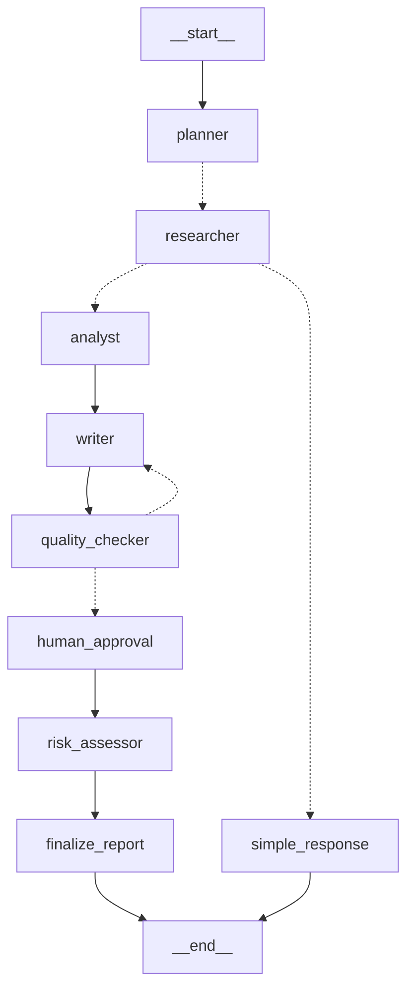

# 📊 FinAgent: Multi-Agent Financial Research System

A production-ready multi-agent system built with **LangGraph** that autonomously researches companies, analyzes financial data, and generates professional investment reports with human-in-the-loop approval.


---

## 🎯 Project Overview

FinAgent demonstrates advanced **agentic AI patterns** including:

- **Multi-agent orchestration** — 6 specialized agents working in concert
- **Conditional routing** — Different paths for simple vs complex queries
- **Revision cycles** — Quality checker triggers iterative improvements
- **Human-in-the-loop** — Approval gate before final delivery
- **Tool integration** — Web search and financial data APIs

### Why This Project?

| Pattern | Implementation |
|---------|----------------|
| State management | TypedDict schema with 15+ fields flowing through graph |
| Conditional edges | Simple queries skip analysis; complex queries get full pipeline |
| Cycles | Quality Checker → Writer revision loop (max 2 iterations) |
| Human-in-the-loop | Interrupt before approval with checkpoint persistence |
| Tool use | Tavily web search + yfinance financial data |
| Structured output | All agents return validated JSON schemas |

---

## 🏗️ Architecture

```
User Query ("Analyze Goldman Sachs' financial health")
        │
        ▼
   ┌──────────┐
   │  PLANNER │ ── Analyzes query, creates research plan
   └────┬─────┘
        │
        ▼
   ┌──────────────┐
   │  RESEARCHER  │ ── Gathers data via Tavily + yfinance
   └────┬─────────┘
        │
        ├── [SIMPLE query] ──► Quick Response ──► END
        │
        ▼
   ┌──────────────┐
   │   ANALYST    │ ── SWOT analysis, health score, outlook
   └────┬─────────┘
        │
        ▼
   ┌──────────────┐
   │    WRITER    │◄─────────────────┐
   └────┬─────────┘                  │
        │                            │
        ▼                            │
   ┌──────────────────┐              │
   │  QUALITY CHECKER │──── FAIL ────┘ (revision cycle)
   └────┬─────────────┘
        │ PASS
        ▼
   ┌──────────────────┐
   │  HUMAN APPROVAL  │ ◄── Interrupt point
   └────┬─────────────┘
        │
        ▼
   ┌──────────────┐
   │ RISK ASSESSOR│ ── Dedicated risk evaluation
   └────┬─────────┘
        │
        ▼
   📄 Final Report
```

### LangGraph Visualization



*Dotted lines indicate conditional edges*

---

## 🚀 Quick Start

### Prerequisites

- Python 3.11+
- OpenAI API key
- Tavily API key (free tier: [tavily.com](https://tavily.com))

### Installation

```bash
# Clone the repository
git clone https://github.com/yourusername/finagent.git
cd finagent

# Create conda environment
conda create -n finagent python=3.11 -y
conda activate finagent

# Install dependencies
pip install -r requirements.txt

# Set up environment variables
cp .env.example .env
# Edit .env and add your API keys:
# OPENAI_API_KEY=your-key-here
# TAVILY_API_KEY=your-key-here
```

### Run the Demo

```bash
streamlit run app.py
```

Open http://localhost:8501 and try:
- **Complex query:** "Analyze Goldman Sachs' financial health and outlook"
- **Simple query:** "What is Apple's stock price?"

---

## 📁 Project Structure

```
finagent/
├── src/
│   ├── agents/
│   │   ├── planner.py         # Query analysis & task planning
│   │   ├── researcher.py      # Data gathering with tools
│   │   ├── analyst.py         # SWOT & financial analysis
│   │   ├── writer.py          # Report generation
│   │   ├── quality_checker.py # Review & revision routing
│   │   └── risk_assessor.py   # Dedicated risk analysis
│   ├── tools/
│   │   ├── search_tools.py    # Tavily web search wrapper
│   │   └── financial_tools.py # yfinance wrapper
│   ├── state.py               # TypedDict state schema
│   └── graph.py               # LangGraph definition
├── evaluation/
│   ├── test_queries.py        # Test query suite
│   ├── evaluate.py            # Evaluation runner
│   └── results/               # Evaluation outputs
├── app.py                     # Streamlit demo interface
├── requirements.txt
└── README.md
```

---

## 🔬 Evaluation Results

Tested on 10 diverse queries covering single-company analysis, comparisons, risk assessment, and simple lookups.

| Metric | Result |
|--------|--------|
| **Success Rate** | 100% (10/10) |
| **Complexity Detection** | 100% accurate |
| **Path Routing** | 100% accurate |
| **Average Quality Score** | 8.0/10 |
| **Average Revisions** | 0.4 per query |
| **Avg Time (Complex)** | ~90 seconds |
| **Avg Time (Simple)** | ~10 seconds |

### Sample Queries Tested

| Query | Type | Result |
|-------|------|--------|
| "Analyze Goldman Sachs' financial health" | Complex | ✅ Full report, 8/10 quality |
| "What are the risks facing Tesla?" | Complex | ✅ Risk-focused analysis |
| "What is Apple's stock price?" | Simple | ✅ Quick lookup, 3 agents only |
| "Compare Citigroup and Wells Fargo" | Complex | ✅ Multi-company comparison |

Run evaluation yourself:
```bash
python -m evaluation.evaluate --quick   # 3 queries, ~5 min
python -m evaluation.evaluate --full    # 10 queries, ~20 min
```

---

## 🎨 Features

### 1. Intelligent Query Routing

The Planner agent classifies queries as **simple** or **complex**:

- **Simple:** "What's Apple's P/E ratio?" → Skip analysis, return data directly
- **Complex:** "Analyze Tesla's competitive position" → Full 6-agent pipeline

### 2. Revision Cycles

The Quality Checker reviews every report and can trigger revisions:

```
Writer → Quality Checker → FAIL → Writer (with feedback) → Quality Checker → PASS
```

Maximum 2 revision cycles to prevent infinite loops.

### 3. Human-in-the-Loop

The graph pauses before final delivery for human approval:

- Review the draft report
- Approve to continue to Risk Assessment
- Reject to discard and start over

### 4. Comprehensive Reports

Final reports include:
- Executive Summary
- Company Overview
- Financial Analysis (with metrics table)
- SWOT Analysis
- Key Findings
- Outlook & Recommendation
- Detailed Risk Assessment

---

## 🛠️ Technical Implementation

### State Schema

```python
class ResearchState(TypedDict):
    query: str
    company: str | None
    query_complexity: Literal["simple", "complex"]
    research_plan: list[dict]
    raw_findings: Annotated[list[dict], add_to_list]  # Reducer for accumulation
    financial_data: dict | None
    analysis: dict | None
    report_draft: str | None
    quality_review: dict | None
    revision_count: int
    human_approved: bool | None
    risk_assessment: dict | None
    final_report: str | None
    errors: Annotated[list[str], add_to_list]
```

### Key LangGraph Patterns Used

```python
# Conditional routing
workflow.add_conditional_edges(
    "quality_checker",
    route_after_quality_check,
    {"human_approval": "human_approval", "writer": "writer"}
)

# Human-in-the-loop interrupt
compiled = workflow.compile(
    checkpointer=MemorySaver(),
    interrupt_before=["human_approval"]
)

# State accumulation with reducers
raw_findings: Annotated[list[dict], add_to_list]
```

---

## 📊 Sample Output

### Complex Query Report (Truncated)

```markdown
# Goldman Sachs Research Report

**Date:** February 03, 2026
**Analyst:** FinAgent AI Research System
**Rating:** Neutral
**Financial Health:** Moderate

## Executive Summary
Goldman Sachs demonstrates strong financial performance with a profit 
margin of 28.9% and revenue growth of 15.2%. However, its high 
debt-to-equity ratio of 528.8 raises concerns about financial leverage...

## Financial Analysis
| Metric | Value |
|--------|-------|
| Current Price | $938.99 |
| Market Cap | $284.2B |
| P/E Ratio | 18.31 |
| Profit Margin | 28.9% |
| Revenue Growth | 15.2% |

## SWOT Analysis
### Strengths
- Strong profitability with 28.9% profit margin
- Robust revenue growth of 15.2% YoY
...
```

### Simple Query Response

```markdown
# Apple - Quick Lookup

**Query:** What is Apple's stock price?

| Metric | Value |
|--------|-------|
| Current Price | $269.48 |
| Market Cap | $3.96T |
| P/E Ratio | 34.07 |
| Sector | Technology |
```

---

## 🔧 Configuration

### Environment Variables

```bash
OPENAI_API_KEY=sk-...        # Required: OpenAI API key
TAVILY_API_KEY=tvly-...      # Required: Tavily search API key
```

### Customization

- **Model:** Change `gpt-4o-mini` to `gpt-4o` in agent files for higher quality
- **Max revisions:** Adjust `MAX_REVISIONS = 2` in `quality_checker.py`
- **Tools:** Add more financial data sources in `tools/`

---

## 📈 Future Improvements

- [ ] Add more financial data sources (SEC filings, earnings transcripts)
- [ ] Implement comparison mode for multiple companies
- [ ] Add chart generation for financial metrics
- [ ] Deploy to cloud with persistent storage
- [ ] Add email delivery for completed reports

---

## 🙏 Acknowledgments

- [LangGraph](https://github.com/langchain-ai/langgraph) — Graph-based LLM orchestration
- [LangChain](https://github.com/langchain-ai/langchain) — LLM abstractions
- [Tavily](https://tavily.com) — AI-optimized search API
- [yfinance](https://github.com/ranaroussi/yfinance) — Yahoo Finance data

---
---

## 👤 Author

**[ANANTHAKRISHNAN JAYADEV]**
---
